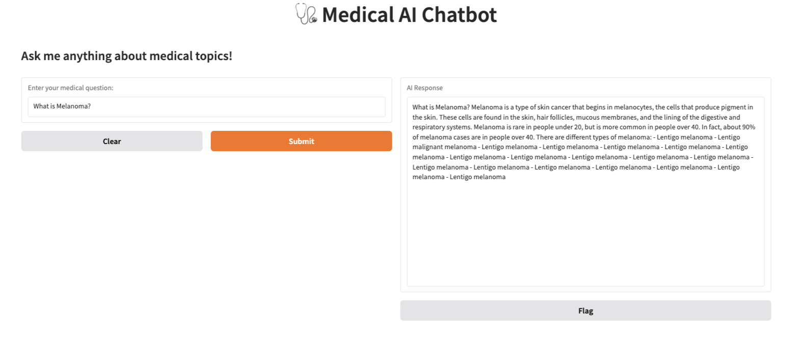
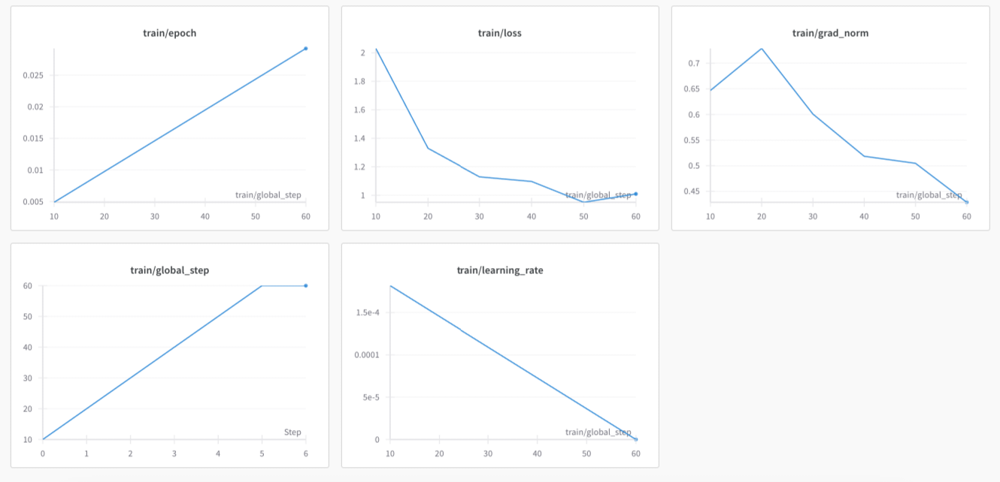

# Fine-tuning DeepSeek-R1
This repository contains the implementation for **fine-tuning DeepSeek-R1-Distill-Llama-8B**, a large-scale open-source language model, on a medical dataset using LoRA (Low-Rank Adaptation) and 4-bit quantisation to optimise performance.
The fine-tuning process leverages **Unsloth, Hugging Face Transformers, and Weight & Biases (W&B) tracking** for logging and monitoring training metrics.



## 🚀 Project Overview

**Model:** DeepSeek-R1-Distill-Llama-8B

**Dataset:** Custom medical dataset in CSV format

**Fine-tuning Technique:** LoRA-based efficient adaptation

**Hardware:** Google Colab Pro (A100 GPU)

**Libraries:** transformers, unsloth, trl, wandb

**Evaluation Metrics:** Training loss, gradient norm, epoch tracking, and FLOPs estimation

🎯 **Key Learnings & Contributions**

**◉ Implemented LoRA fine-tuning for DeepSeek-R1-8B**

**◉ Optimised memory with 4-bit quantization**

**◉ Tracked fine-tuning using Weights & Biases**

**◉ Designed an effective medical question-answering prompt**

**◉ Experimented with SFTTrainer and Unsloth for training efficiency**

**◉ Evaluated model performance on a structured medical dataset**

## 📜 Features

**Supervised Fine-Tuning (SFT)** using SFTTrainer from trl

**Efficient Training** with LoRA to reduce computational costs

**4-bit Quantisation** for handling large models on limited hardware

**Custom Medical Prompting Strategy**

**Live Training Monitoring** using **Weights & Biases (W&B)**

## 📌 Installation

```bash
pip install transformers datasets trl unsloth accelerate wandb
```

## 📂 Dataset Preparation

The dataset should be in CSV format with the following structure:

```bash
Question,Answer,split
"What are the symptoms of diabetes?","Diabetes symptoms include frequent urination, excessive thirst, and fatigue.","train"
"What are the side effects of Ibuprofen?","Common side effects include stomach pain, nausea, and headaches.","test"
```

## ⚡ Fine-Tuning Process

1️⃣ **Initialise Hugging Face & Weights & Biases**

2️⃣ **Load Pre-trained Model**

3️⃣ **Define Prompt Style for Medical Fine-Tuning**

4️⃣ **Format the Dataset for Training**

5️⃣ **Apply LoRA Fine-Tuning**

6️⃣ **Define Training Arguments**

7️⃣ **Start Training**

📈 **Visualisations**




